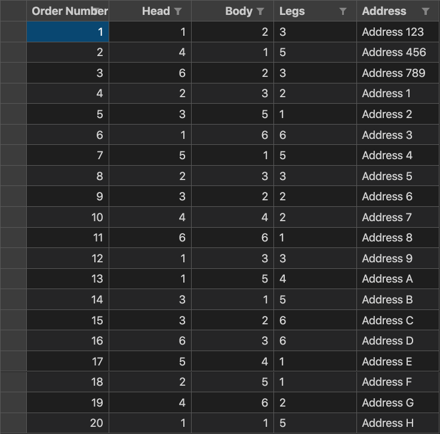
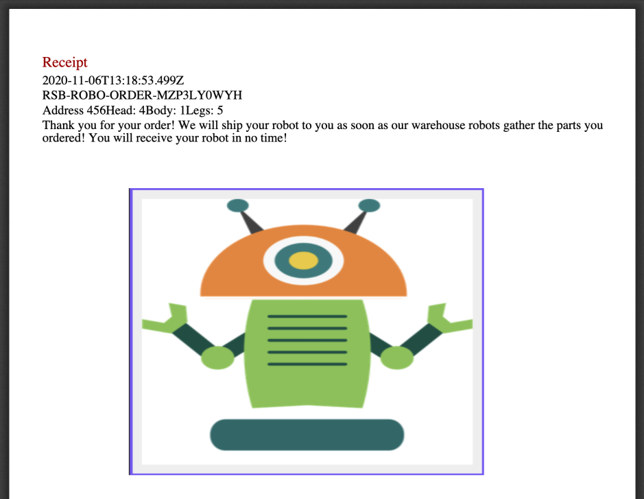

# Robot Rules
- The robot should use the [orders file (.csv )](https://robotsparebinindustries.com/orders.csv) and complete all the orders in the file.

- Only the robot is allowed to get the orders file. You may not save the file manually on your computer.
- The robot should save each order HTML receipt as a PDF file.
- The robot should save a screenshot of each of the ordered robots.
- The robot should embed the screenshot of the robot to the PDF receipt.

- The robot should create a ZIP archive of the PDF receipts (one zip archive that contains all the PDF files). Store the archive in the output directory.
- The robot should complete all the orders even when there are technical failures with the robot order website.
- The robot should be available in public GitHub repository.
- It should be possible to get the robot from the public GitHub repository and run it without manual setup.
